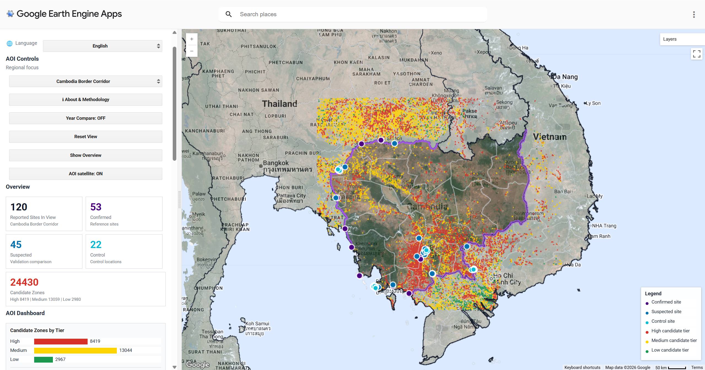

---
title-block-banner: images/banner.png
title: "Scam Compound Explorer"
subtitle: "Remote Sensing Detection of Suspected Scam Compounds in Southeast Asia"
format:
  html:
    toc: true
    toc-depth: 4
    toc-title: "Contents"
    toc-location: left
    toc-expand: true
    number-sections: false
    page-layout: full
    grid:
      sidebar-width: 250px
      body-width: 900px
      margin-width: 100px
    css: scam_wanqi.css
---

## Project Summary

This project develops a Google Earth Engine (GEE)鈥揵ased application for exploring candidate
locations which spatially similar to documented scam compound sites, and explore spatial
patterns of suspected scam compounds in Southeast Asia, specifically within Cambodia. This
model, referencing data from Amnesty International(2025) and Australian Strategic Policy Institute (ASPI) (2025), extracts remote-sensing 
indicators associated with compound-like development patterns to identify high-risk areas. 
The Cambodia鈥揤ietnam analysis contains 53 confirmed reported sites, 45 suspected reported 
sites, and 22 control points within the AOI. Confirmed sites were used to build a reproducible 
embedding-based screening workflow, while suspected and control points were used to evaluate 
whether the output behaved as a broad screening layer or a more selective prioritisation layer.
This dual approach allows for a rigorous comparison between verified sites of human rights 
abuse and uninvestigated candidate locations. The interactive web platform can provides a 
reproducible satellite-based screening workflow for researchers, journalists and human-rights 
monitors, and help governments and law enforcement agencies combat criminal gangs to some 
extent, and better protect national border security.

::: {style="text-align: center;"}
{width=100%}

<p style="font-size: 0.9em; margin-top: 0.5em;">Resource From: United Nations Office on Drugs and Crime (2023, 2025), Global Initiative (2026)</p>
:::

---

### Problem Statement

Transnational organized crime and the rapid expansion of cyber scams across Southeast Asia have emerged as a significant humanitarian and security crisis (UNODC, 2025). Despite their scale, these compounds remain difficult to systematically detect due to their strategic placement in border regions and their deliberate spatial overlap with legitimate commercial environments (ASPI, 2025). Traditional monitoring is often hindered by fragmented reporting and a critical shortage of verified ground-truth data (Global Initiative, 2026). Our application addresses this gap by providing a reproducible, satellite-based screening tool that bridges the divide between remote sensing technology and policy-oriented investigation. By grounding our analysis in documented reference cases, this platform offers an intuitive interface for researchers and policymakers to visualize high-risk expansion zones锛宧elps overcome long-standing barriers in cross-border data sharing and regional security planning.

### End User

Our platform is designed for human rights monitoring agencies, investigative journalists,
and policy-oriented researchers working to combat transnational crime in Southeast Asia.
Limited public information and complex on-the-ground situations have long hampered the
effectiveness of international interventions. Our interactive maps significantly enhance
data accessibility and applicability, fostering collaboration among global stakeholders
and providing robust spatial evidence to support international initiatives against forced
labour, human trafficking, and torture.

---

### Data

<!-- TODO: 鏁版嵁缁勮ˉ鍏呭畬鏁存暟鎹鏄?-->

| Category | Dataset | Description | Source |
|----------|---------|-------------|--------|
| Satellite Embedding | Google Satellite Embedding V1 Annual | 64-dimensional annual embedding vectors at 10 m resolution, used for Stage 1 similarity search | [GEE Catalog](https://developers.google.com/earth-engine/datasets/catalog/GOOGLE_SATELLITE_EMBEDDING_V1_ANNUAL) |
| Satellite Imagery | Sentinel-2 SR Harmonised | Multispectral imagery for NDBI, NDVI and visual basemap (2021鈥?024) | [GEE Catalog](https://developers.google.com/earth-engine/datasets/catalog/COPERNICUS_S2_SR_HARMONIZED) |
| Night-time Lights | VIIRS DNB Monthly | Night-time radiance for activity growth detection (dNTL 2021鈥?024) | [GEE Catalog](https://developers.google.com/earth-engine/datasets/catalog/NOAA_VIIRS_DNB_MONTHLY_V1_VCMSLCFG) |
| Boundaries | USDOS LSIB Simple 2017 | Country boundary geometries for AOI definition | [GEE Catalog](https://developers.google.com/earth-engine/datasets/catalog/USDOS_LSIB_SIMPLE_2017) |
| Boundaries | FAO GAUL 2015 | Province-level administrative boundaries | [GEE Catalog](https://developers.google.com/earth-engine/datasets/catalog/FAO_GAUL_2015_level1) |
| Reference Sites | Confirmed Scam Locations | 53 confirmed sites from Amnesty International and ASPI | [Amnesty International](https://www.amnesty.org) |
| Reference Sites | Suspected and Control Points | 45 suspected sites and 22 control points for validation | [ASPI](https://www.aspi.org.au) |

Based on precise location data from Amnesty International (2025) and ASPI (2025), our final compiled dataset includes confirmed points, suspected points, and control points on GitHub: [scam_points_update.csv](https://github.com/Levine-l/CASA0025_project_workspace/blob/main/data_processed/scam_points_update.csv){target="_blank"}

---

### Methodology

<!-- TODO: 鍒嗘瀽缁勮ˉ鍏呮柟娉曡鏄?-->

The analysis pipeline operates in two stages:

**Stage 1 鈥?Satellite Embedding Similarity**

Stage 1 uses the Google Satellite Embedding V1 annual dataset for 2024. In this dataset, 
each pixel is represented by a 64-dimensional embedding vector that summarises multi-source 
satellite information. Within the Cambodia鈥揤ietnam Aoi, 53 confirmed reported sites were 
available, but only three reproducible confirmed Cambodia reference samples were used for 
the current embedding run. This small reference set was retained after sensitivity testing 
because increasing the reference count did not materially improve recovery of known sites, but 
increased computation.

For each reference sample, the embedding vector was compared with every pixel in the AOI using 
dot-product similarity. The final similarity surface was calculated as the mean of each reference 
similarity images:

$$
s_j(x)=\mathbf{e}(x)\cdot\mathbf{r}_j
      =\sum_{k=0}^{63} e_k(x)r_{j,k}
$$

$$
S(x)=\frac{1}{J}\sum_{j=1}^{J}s_j(x)
$$

Pixels were retained where their mean similarity exceeded the 97th percentile of the sampled 
similarity distribution:

$$
\text{Stage 1 candidate}(x)=
\begin{cases}
1, & S(x)\geq P_{97}(S) \\
0, & S(x)<P_{97}(S)
\end{cases}
$$

- x is a pixel within the AOI;
- e(x) is the 64-dimensional embedding vector of that pixel;
- rj is the embedding vector of the j-th confirmed reference sample;
- J is the current number of reference samples (J=3 at this condition);
- S(x) is the final mean similarity image.

Small isolated fragments were removed using a connected pixel filter, and the cleaned raster was 
vectorised into Stage 1 candidate points. The p97 setting was selected because it was tighter than 
p95 while retaining high coverage of known confirmed and suspected locations.

**Stage 2 鈥?Indicator-Based Refinement**

Stage 1 is intentionally broad, so Stage 2 refines the candidate set using interpretable contextual 
indicators. Candidate points were converted into 500 m buffered zones, and mean values were extracted 
from a 2021鈥?024 metric stack containing Sentinel-2 spectral indices, VIIRS night-time lights, and 
distance variables.

The main change metrics are:

$$
\text{NDVI}=\frac{NIR-Red}{NIR+Red}
$$

$$
\text{NDBI}=\frac{SWIR-NIR}{SWIR+NIR}
$$

$$
\Delta X = X_{2024}-X_{2021}
$$

And an increase in built up signal combined with a decrease in vegetation signal is defined as 
development evidence :

$$
\text{development flag} = (\Delta \text{NDBI} > 0) \land (\Delta \text{NDVI} < 0)
$$

Activity evidence is defined as an increase in night time light radiance:

$$
\text{activity flag} = \Delta \text{NTL} > 0
$$

Candidates then assigned to priority tiers. High priority candidates triggered both development 
and activity flags; medium priority candidates triggered one of the two flags; and low-priority 
candidates triggered neither flag but retained to preserve uncertainty. Border distance was retained 
as contextual information rather than used as a hard filtering gate in the final tiering.

**Validation**

Validation conduct in two parts. 
First, Stage 1 was evaluated using raster overlap checks against suspected sites, non-reference 
confirmed sites, held out confirmed samples, and control points. This shows that the 97th percentile 
embedding layer had very high recall, including a mean held out confirmed recall of 1.0 across 
repeated splits, but it also capture control points. Therefore, Stage 1 is interpreted as a high 
recall screening surface rather than a precise classifier.

Second, Stage 2 was evaluated using vector overlap checks for the high, medium, low, and all refined 
candidate layers. The refined layer reduced control hits from 22/22 under Stage 1 to 7/22 for all 
refined candidates within 500 m, but recall for known sites also dropped. Therefore, the final output 
should be read as a prioritisation layer for further investigation, not as a verified list of scam 
compounds.

---

### Interface

The interface is designed as a screening dashboard rather than a static map. The main view
uses the Cambodia Border Corridor because it shows the core workflow most clearly: candidate
tiers, reported site markers, boundary context and the AOI summary panel. The second view
shows the Year Compare mode, where users can drag the divider to compare built-up growth
(dNDBI) and night light growth (dNTL) across the same area.

:::: {.columns layout-align="center"}
::: {.column width="48%"}


*Cambodia Border Corridor view*
:::
::: {.column width="4%"}
:::
::: {.column width="48%"}


*Year Compare view*
:::
::::

The left control panel lets users switch regional focus, toggle Year Compare, reset the map
and review AOI-level counts. The map layers combine candidate zones by tier, confirmed,
suspected and control sites, province boundaries and highlighted shared borders.

---

## The Application

The live Google Earth Engine application is embedded below. If the embedded view loads slowly
or is blocked by the browser, open it directly in a new tab:
[Scam Compound Explorer](https://orbital-kit-415514.projects.earthengine.app/view/scam-compound-explorer){target="_blank"}.

::: {.column-page}
<iframe src="https://orbital-kit-415514.projects.earthengine.app/view/scam-compound-explorer"
        width="100%" height="760px"
        style="border: 1px solid #dbeafe; border-radius: 6px;"></iframe>
:::

---

## How it Works

The application is built entirely in Google Earth Engine and links the analytical pipeline
to an interactive screening interface. The workflow is organised into four parts.

### 1. Insights and Objectives

The tool responds to a practical analytical challenge: reported scam compounds are often
clustered near border corridors, special economic zones and rapidly changing peri-urban
landscapes, but public evidence remains uneven across countries. Instead of treating the
map as a definitive inventory, the application provides a transparent screening layer that
helps users compare known reports with satellite-derived signals of recent construction and
night-time activity.

The main objective is to prioritise locations for further investigation. The app combines
embedding similarity, Sentinel-2 built-up change, VIIRS night light change and proximity
context, then presents the results as high, medium and low candidate tiers. Confirmed,
suspected and control sites are retained in the interface so users can assess where the
model aligns with existing evidence and where it may be over- or under-selecting.

### 2. Data Preparation and Precomputations

Before the app is loaded, the main candidate surfaces and diagnostic metrics are prepared
in Google Earth Engine. Precomputing these outputs keeps the interface responsive and avoids
running expensive overlap checks every time users change views. Below are key code examples
illustrating the core logic.

**Stage 1: Embedding Similarity**
```js
var embeddings = ee.ImageCollection('GOOGLE/SATELLITE_EMBEDDING/V1/ANNUAL');

var embeddingImage = embeddings
  .filter(ee.Filter.date(startDate, endDate))
  .mosaic()
  .clip(analysisGeometry);

var sampleEmbeddings = embeddingImage.sampleRegions({
  collection: referenceSamples,
  scale: sampleScale,
  geometries: false,
  tileScale: 4
});

var similarityImages = ee.ImageCollection.fromImages(
  sampleEmbeddings.toList(sampleEmbeddings.size()).map(function(f) {
    f = ee.Feature(f);

    var sampleValues = ee.List(
      bandNames.map(function(b) {
        return f.get(ee.String(b));
      })
    );

    var sampleVectorImage = ee.Image.constant(sampleValues)
      .rename(bandNames)
      .toFloat();

    return sampleVectorImage
      .multiply(embeddingImage)
      .reduce(ee.Reducer.sum())
      .rename('similarity');
  })
);

var meanSimilarity = similarityImages.mean();
```


**Stage 2.1: Computing NDBI Change**

```js
function getS2Composite(year, aoi) {
  var startDate = ee.Date.fromYMD(year, 1, 1);
  var endDate = startDate.advance(1, 'year');

  return ee.ImageCollection('COPERNICUS/S2_SR_HARMONIZED')
    .filterBounds(aoi)
    .filterDate(startDate, endDate)
    .filter(ee.Filter.lt('CLOUDY_PIXEL_PERCENTAGE', 20))
    .map(maskS2Clouds)
    .select(['B2', 'B3', 'B4', 'B8', 'B11'])
    .median()
    .clip(aoi);
}

function buildS2MetricsImage(yearA, yearB, aoi) {
  var s2A = getS2Composite(yearA, aoi);
  var s2B = getS2Composite(yearB, aoi);

  var ndviA = s2A.normalizedDifference(['B8', 'B4']).rename('NDVI_' + yearA);
  var ndviB = s2B.normalizedDifference(['B8', 'B4']).rename('NDVI_' + yearB);

  var ndbiA = s2A.normalizedDifference(['B11', 'B8']).rename('NDBI_' + yearA);
  var ndbiB = s2B.normalizedDifference(['B11', 'B8']).rename('NDBI_' + yearB);

  var dNDVI = ndviB.subtract(ndviA).rename('dNDVI_' + yearA + '_' + yearB);
  var dNDBI = ndbiB.subtract(ndbiA).rename('dNDBI_' + yearA + '_' + yearB);

  return ndviA.addBands(ndviB).addBands(ndbiA).addBands(ndbiB)
              .addBands(dNDVI).addBands(dNDBI);
}
```

**Stage 2.2: Candidate Tier Classification**

```js
var finalSummary = candidateMetrics.map(function(f) {
  var dNdbi = ee.Number(f.get('dNDBI_2021_2024'));
  var dNdvi = ee.Number(f.get('dNDVI_2021_2024'));
  var dNtl = ee.Number(f.get('dNTL_2021_2024'));
  var ntl2024 = ee.Number(f.get('NTL_2024'));
  var distConfirmed = ee.Number(f.get('dist_to_confirmed_m'));
  var distBorder = ee.Number(f.get('dist_to_border_m'));

  var developmentFlag = dNdbi.gt(0).and(dNdvi.lt(0));
  var activityFlag = dNtl.gt(0);
  var nearBorderFlag = distBorder.lt(10000);

  var highPriority = developmentFlag.and(activityFlag);
  var mediumPriority = developmentFlag.or(activityFlag);

  var operationalHighFlag = highPriority
    .and(distConfirmed.lt(5000))
    .and(ntl2024.gt(5))
    .and(dNtl.gt(0));

  var tier = ee.String(ee.Algorithms.If(
    highPriority, 'high',
    ee.Algorithms.If(mediumPriority, 'medium', 'low')
  ));

  var operationalTier = ee.String(ee.Algorithms.If(
    operationalHighFlag,
    'operational_high',
    tier
  ));

  return f.set({
    development_flag: developmentFlag,
    activity_flag: activityFlag,
    near_border_flag: nearBorderFlag,
    priority_tier: tier,
    operational_high_flag: operationalHighFlag,
    operational_priority_tier: operationalTier
  });
});
```

### 3. Interactive Visualization and Analysis

The interactive app renders the precomputed outputs as map layers, charts and linked
controls. Because the study area is transnational, the interface is organised by regional
scale and evidence type rather than by national or district administrative units.

#### Study Region Overview

The Southeast Asia overview provides a broad spatial context for the five study countries:
Cambodia, Thailand, Vietnam, Lao PDR and Myanmar. This view is used to frame the project as
a cross-border problem and to show how reported scam-related locations are distributed
across multiple jurisdictions rather than within one national system.

**Regional AOI setup**

```js
var AOIS = {
  'Cambodia Border Corridor': AOI_CV,
  'Myanmar-Thailand Border': AOI_MT,
  'Golden Triangle (future extension)': AOI_GT,
  'Southeast Asia overview': AOI_SEA
};

var AOI_VIEWS = {
  'Cambodia Border Corridor': {lon: 104.5, lat: 13.0, zoom: 7},
  'Myanmar-Thailand Border':  {lon: 98.8,  lat: 17.2, zoom: 6},
  'Golden Triangle (future extension)': {lon: 100.2, lat: 21.0, zoom: 8},
  'Southeast Asia overview': {lon: 102.5, lat: 15.5, zoom: 5}
};

function setMapToAoiView(targetMap, aoiName) {
  var view = AOI_VIEWS[aoiName] || AOI_VIEWS[DEFAULT_AOI];
  targetMap.setCenter(view.lon, view.lat, view.zoom);
}
```

#### Border Corridor Focus

Users can switch from the regional overview into specific border corridors, including the
Cambodia Border Corridor, Myanmar-Thailand and the Golden Triangle future extension. These
AOIs make the map easier to interpret by focusing on the corridor scale at which compounds,
special economic zones, transport routes and border enforcement issues are most relevant.

**AOI switching and layer refresh**

```js
function renderAoi(aoiName) {
  activeRenderId += 1;
  var renderId = activeRenderId;
  var aoiData  = getAoiData(aoiName);

  activeAoiName         = aoiName;
  activeAoi             = aoiData.geometry;
  activePointsInAoi     = aoiData.points;
  activeCandidatesInAoi = aoiData.candidates;
  activeTierCollections = aoiData.tiers;

  var stack = buildLayerStack(aoiName);
  applyLayerStack(stack);
  setMapToAoiView(map, aoiName);

  updateLayerControls(stack);
  updateKpis(aoiData.points, aoiData.candidates, renderId, aoiName);
  setEvidencePlaceholder(aoiName);
  setDefaultInfo();
  buildDashboard(aoiName);
}
```

#### Candidate Tier and Reported Site Analysis

The main analytical view compares high, medium and low candidate tiers with confirmed,
suspected and control sites. The left dashboard summarises reported sites, reference sites,
control locations and candidate counts for the selected AOI, while the map shows whether
candidate clusters coincide with known reports or appear in areas with limited existing
documentation.

Candidate density is included in this part of the workflow because it translates many
individual candidate geometries into a readable spatial concentration layer. This helps
users identify clusters and compare them with reported site markers without treating every
candidate pixel as an isolated finding.

**Candidate tier map layer**

```js
var CANDIDATE_TIER_PALETTE = [COLORS.low, COLORS.medium, COLORS.high];
var CANDIDATE_PIXEL_RADIUS_M = 750;

function makeCandidateTierImage(tiers, aoi) {
  var PAINT_SCALE = 1000;
  var low = ee.Image().byte()
    .paint(tiers.low, 1)
    .setDefaultProjection('EPSG:3857', null, PAINT_SCALE)
    .focal_max(CANDIDATE_PIXEL_RADIUS_M, 'square', 'meters');
  var medium = ee.Image().byte()
    .paint(tiers.medium, 2)
    .setDefaultProjection('EPSG:3857', null, PAINT_SCALE)
    .focal_max(CANDIDATE_PIXEL_RADIUS_M, 'square', 'meters');
  var high = ee.Image().byte()
    .paint(tiers.high, 3)
    .setDefaultProjection('EPSG:3857', null, PAINT_SCALE)
    .focal_max(CANDIDATE_PIXEL_RADIUS_M, 'square', 'meters');

  return low.blend(medium).blend(high)
    .reproject({crs: 'EPSG:3857', scale: PAINT_SCALE})
    .clip(aoi)
    .selfMask();
}

if (!candidateTierCache[candidateTierKey]) {
  candidateTierCache[candidateTierKey] = makeCandidateTierImage(aoiData.tiers, STUDY_GEOM);
}

var stack = {
  candidateTiers: ui.Map.Layer(candidateTierCache[candidateTierKey], {
    min: 1,
    max: 3,
    palette: CANDIDATE_TIER_PALETTE,
    opacity: 0.85
  }, 'Candidate Zones by Tier', true)
};
```

**Candidate Density Visualisation**

This density example belongs to the precomputation workflow rather than the live app file.
The live app displays the resulting candidate tiers as a cached map layer, while the
precomputation step below shows how candidate geometries can be converted into a smoothed
concentration surface for exploratory analysis.

```js
// Paint candidate polygons at 1 km scale and apply smoothing kernel
var painted = ee.Image().byte().paint(candidates, 1)
  .setDefaultProjection('EPSG:3857', null, 1000);

var kernel = ee.Kernel.square({radius: 12000, units: 'meters', normalize: false});

var densityImage = painted
  .reduceNeighborhood({reducer: ee.Reducer.sum(), kernel: kernel, optimization: 'boxcar'})
  .resample('bilinear')
  .clip(aoi)
  .selfMask();
```

The Stage 2 pipeline retains 24,464 refined candidate zones and assigns them to analytical 
priority tiers. A much smaller operational shortlist of 15 candidates is used for default 
display, but these are not confirmed sites.

| Output group | Count | Meaning |
|-------------|------:|---------|
| Stage 1 candidate points | 24,464 | Broad embedding-based screening output |
| Stage 2 high tier | 8,425 | Triggered both development and activity flags |
| Stage 2 medium tier | 13,059 | One of the two flags triggered |
| Stage 2 low tier | 2,980 | Neither flag triggered, retained for uncertainty |
| Operational shortlist | 15 | Narrow default display subset using stricter distance and night time light conditions |

#### Temporal Change and Methodology Review

The Year Compare mode supports temporal interpretation by showing built-up growth (dNDBI)
and night light growth (dNTL) in a draggable split view. The methodology and validation
panels provide additional transparency by summarising the screening stages, overlap checks
and evidence scatter plots, so users can review both the mapped outputs and the assumptions
behind them.

**Year Compare change layers**

```js
function buildSplitCompareImages(cacheKey, compareGeometry) {
  if (splitCompareCache[cacheKey]) {
    return splitCompareCache[cacheKey];
  }

  var s2_2021 = ee.ImageCollection('COPERNICUS/S2_SR_HARMONIZED')
    .filterBounds(compareGeometry)
    .filterDate('2021-01-01', '2021-12-31')
    .filter(ee.Filter.lt('CLOUDY_PIXEL_PERCENTAGE', 30))
    .select(['B11', 'B8'])
    .median();

  var s2_2024 = ee.ImageCollection('COPERNICUS/S2_SR_HARMONIZED')
    .filterBounds(compareGeometry)
    .filterDate('2024-01-01', '2024-12-31')
    .filter(ee.Filter.lt('CLOUDY_PIXEL_PERCENTAGE', 30))
    .select(['B11', 'B8'])
    .median();

  var ndbi2021 = s2_2021.normalizedDifference(['B11', 'B8']).rename('NDBI');
  var ndbi2024 = s2_2024.normalizedDifference(['B11', 'B8']).rename('NDBI');
  var dNDBI = ndbi2024.subtract(ndbi2021).rename('dNDBI')
    .clip(compareGeometry);
  var dNDBIGrowth = dNDBI.updateMask(dNDBI.gt(0.015));

  var ntl2021 = ee.ImageCollection('NOAA/VIIRS/DNB/MONTHLY_V1/VCMSLCFG')
    .filterBounds(compareGeometry)
    .filterDate('2021-01-01', '2021-12-31')
    .select('avg_rad')
    .median();

  var ntl2024 = ee.ImageCollection('NOAA/VIIRS/DNB/MONTHLY_V1/VCMSLCFG')
    .filterBounds(compareGeometry)
    .filterDate('2024-01-01', '2024-12-31')
    .select('avg_rad')
    .median();

  var dNTL = ntl2024.subtract(ntl2021).rename('dNTL')
    .clip(compareGeometry);
  var dNTLGrowth = dNTL.updateMask(dNTL.gt(0.25));

  splitCompareCache[cacheKey] = {
    dNDBIGrowth: dNDBIGrowth,
    dNTLGrowth:  dNTLGrowth
  };
  return splitCompareCache[cacheKey];
}
```

### 4. Limitations and Potential Expansion

The outputs should be interpreted as prioritisation evidence, not confirmed scam compound
locations. The workflow depends on public reports, known reference sites, cloud-filtered
Sentinel-2 composites and VIIRS night light signals, so both false positives and false
negatives are expected. Dense urban growth, industrial sites, border trade zones and other
large facilities can produce similar satellite signatures.

Future expansion could add more verified reference sites, integrate higher-resolution
commercial imagery where available, include additional years for temporal monitoring and
extend the same interface logic to the Golden Triangle and other Southeast Asian border
corridors. The current design keeps these extensions possible by separating precomputed
candidate layers from the interactive map controls.

<script>
function applyManualJsHighlight() {
  function escapeHtml(text) {
    return text
      .replace(/&/g, '&amp;')
      .replace(/</g, '&lt;')
      .replace(/>/g, '&gt;');
  }

  function colourJs(code) {
    var keywords = {
      'var': true, 'function': true, 'return': true, 'if': true,
      'null': true, 'true': true, 'false': true
    };
    var output = '';
    var i = 0;

    while (i < code.length) {
      var rest = code.slice(i);
      var comment = rest.match(/^\/\/[^\n]*/);
      if (comment) {
        output += '<span class="js-comment">' + escapeHtml(comment[0]) + '</span>';
        i += comment[0].length;
        continue;
      }

      var stringMatch = rest.match(/^'(?:\\.|[^'\\])*'|^"(?:\\.|[^"\\])*"/);
      if (stringMatch) {
        output += '<span class="js-string">' + escapeHtml(stringMatch[0]) + '</span>';
        i += stringMatch[0].length;
        continue;
      }

      var method = rest.match(/^\.([A-Za-z_$][\w$]*)/);
      if (method) {
        output += '.<span class="js-method">' + escapeHtml(method[1]) + '</span>';
        i += method[0].length;
        continue;
      }

      var number = rest.match(/^\b\d+(?:\.\d+)?\b/);
      if (number) {
        output += '<span class="js-number">' + escapeHtml(number[0]) + '</span>';
        i += number[0].length;
        continue;
      }

      var word = rest.match(/^[A-Za-z_$][\w$]*/);
      if (word) {
        var token = word[0];
        if (keywords[token]) {
          output += '<span class="js-keyword">' + escapeHtml(token) + '</span>';
        } else if (/^[A-Z0-9_]{3,}$/.test(token)) {
          output += '<span class="js-constant">' + escapeHtml(token) + '</span>';
        } else {
          output += escapeHtml(token);
        }
        i += token.length;
        continue;
      }

      output += escapeHtml(code[i]);
      i += 1;
    }
    return output;
  }

  document.querySelectorAll('pre.sourceCode.js code.sourceCode.javascript').forEach(function(codeBlock) {
    if (codeBlock.querySelector('span')) { return; }
    codeBlock.innerHTML = colourJs(codeBlock.textContent);
  });
}

if (document.readyState === 'loading') {
  document.addEventListener('DOMContentLoaded', applyManualJsHighlight);
} else {
  applyManualJsHighlight();
}
</script>


---

## References

<!-- TODO: 鍏ㄧ粍琛ュ厖瀹屾暣鍙傝€冩枃鐚?-->

- Amerhauser, K. and Goodwin, A. (2026) A world of deceit: Mapping the landscape of the global scam centre phenomenon. Geneva: Global Initiative Against Transnational Organized Crime. Available at: https://globalinitiative.net/wp-content/uploads/2026/03/Kristina-Amerhauser-Alex-Goodwin-A-world-of-deceit-Mapping-the-landscape-of-the-global-scam-centre-phenomenom-GI-TOC-March-2026.pdf (Accessed: 25 April 2026).

- Amnesty International (2023). *Trapped: The Human Suffering behind the Scam Centres*.
  London: Amnesty International.

- Amnesty International (2025). 鈥業 was someone else鈥檚 property鈥? Slavery, human trafficking and torture in Cambodia鈥檚 scamming compounds. [online] Available at: https://www.amnesty.org/en/wp-content/uploads/2025/06/ASA2394472025ENGLISH.pdf [Accessed 25 Apr. 2026].

- Australian Strategic Policy Institute (2023). *Mapping the Scam Compound Industry
  in Southeast Asia*. Canberra: ASPI.

- Google Earth Engine (n.d.) *Satellite Embedding V1 Annual*. Google Earth Engine Data Catalog. Available at: https://developers.google.com/earth-engine/datasets/catalog/GOOGLE_SATELLITE_EMBEDDING_V1_ANNUAL (Accessed: 25 April 2026).

- Google Earth Engine Community (n.d.) *Satellite Embedding 05: Similarity Search*. Available at: https://developers.google.com/earth-engine/tutorials/community/satellite-embedding-05-similarity-search (Accessed: 25 April 2026).

- Gorelick, N., Hancher, M., Dixon, M., Ilyushchenko, S., Thau, D. and Moore, R.
  (2017). Google Earth Engine: Planetary-scale geospatial analysis for everyone.
  *Remote Sensing of Environment*, 202, pp.18鈥?7.
  https://doi.org/10.1016/j.rse.2017.06.031

- UNODC (2023) Trafficking in Persons for the Purpose of Forced Criminality: Summary Policy Brief. Available at: https://www.unodc.org/roseap/uploads/documents/Publications/2023/TiP_for_FC_Summary_Policy_Brief.pdf (Accessed: 25 April 2026).

- UNODC (2025) Inflection Point: Transnational Organized Crime and the Changing Landscape of Cyber-Enabled Fraud in Southeast Asia. Available at: https://www.unodc.org/roseap/uploads/documents/Publications/2025/Inflection_Point_2025.pdf (Accessed: 25 April 2026).

  
<table style="background-color:#60a5fa; width:100vw; margin-left:calc(-50vw + 50%); margin-top:80px; padding:0 40px; box-sizing:border-box; border:none;">
  <tr>
    <td style="color:#eff6ff; font-size:12px; text-align:left; border:none; padding:15px 0;">CASA0025 Group Project</td>
    <td style="color:#eff6ff; font-size:12px; text-align:right; border:none; padding:15px 0;">For all precomputation scripts and main app code, please visit: <a href="https://github.com/浣犱滑鐨勪粨搴撻摼鎺? style="color:#eff6ff;">GitHub Repository</a></td>
  </tr>
</table>

